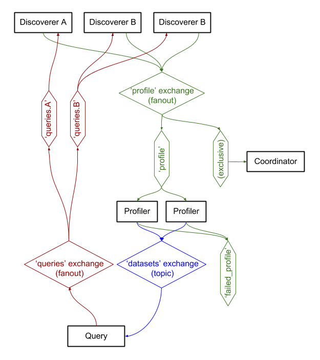

DataMart
========

This project is designed to be a web crawler and search engine for datasets, specifically meant for data augmentation tasks in machine learning. Its goal is to be able to find datasets in different repositories and index them for later retrieval.

It is divided in multiple components:

* Libraries
  * [Client library](lib_client/) `datamart`. This can be installed by clients to query the DataMart server. It is able to perform profiling and materialization locally, if the corresponding libraries are installed.
  * [Profiling library](lib_profiler/) `datamart_profiler`. This can be installed by clients, will allow the client library to profile datasets locally instead of sending them to the server. It is also used by the query and profiler services.
  * [Materialization library](lib_materialize/) `datamart_materialize`. This is used to materialize dataset from the various sources that DataMart supports. It can be installed by clients, which will allow them to materialize datasets locally instead of using the server as a proxy.
  * [Core server library](lib_core/) `datamart_core`. This contains common code for services. Only used for the server components.
* Services
  * [**Discovery services**](discovery/): those are responsible for discovering datasets. Each plugin can talk to a specific repository. *Materialization metadata* is recorded for each dataset, to allow future retrieval of that dataset.
  * [**Profiler**](profiler/): this service downloads a discovered dataset and computes additional metadata that can be used for search (for example, dimensions, semantic types, value distributions). Uses the profiling and materialization libraries.
  * [**Query**](query/): this service responds to queries from clients by looking up datasets in the index, and can trigger on-demand query by discovery services that support it. It can also optionally profile a dataset if a client uploads it (if it couldn't profile it locally), and materialize it if the client requests it (if it can't materialize it locally). Uses the profiling and materialization libraries. Implements a JSON API using the Tornado web framework.
  * [The **coordinator**](coordinator/): this service is in charge of the dataset cache, where discovery plugins download datasets, and that is read by the profiler and query services. It also provides the monitoring facilities, showing a live feed of indexed datasets, and a user-friendly search interface.

Elasticsearch is used as the search index, storing one document per known dataset.

The services exchange messages through `RabbitMQ`, allowing us to have complex messaging patterns with queueing and retrying semantics, and complex patterns such as the on-demand querying.

Deployment
==========

The system is currently running at https://datamart.d3m.vida-nyu.org/. You can see the system status at https://grafana.datamart.d3m.vida-nyu.org/.
